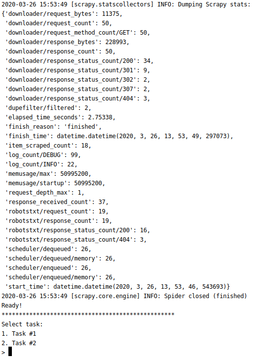
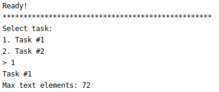
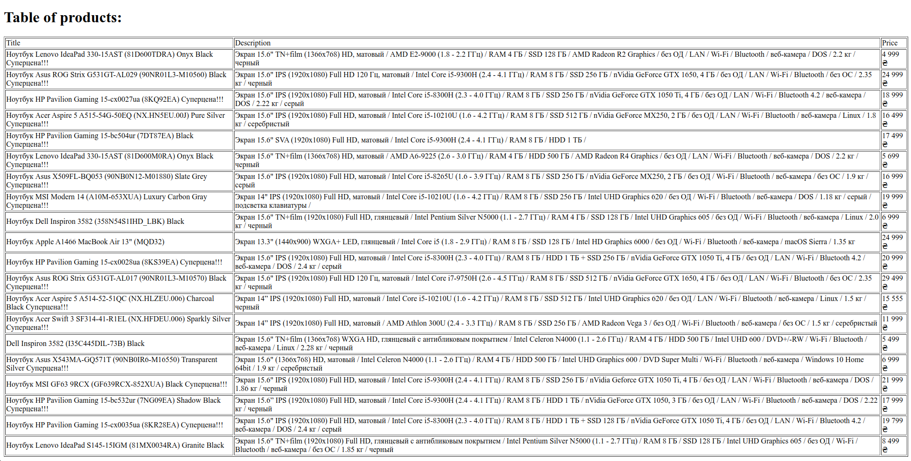

# Лабораторна робота 1: Вивчення базових операцій обробки XML-документів

Абу Шамала Амір Махер, КП-72

## Завдання
##### Варіант 1
| Базова сторінка (завдання 1) | Зміст завдання 2     | Адреса інтернет-магазину (завдання 3) |
|------------------------------|----------------------|---------------------------------------|
| www.kpi.ua | Максимальна кількість текстових фрагментів | www.rozetka.ua |

## Приклади роботи програми

___

___
*Примітка: rozetka.com.ua використовує lazy-loading для зображень, тому Scrapy не може отримати лінку на зображення :(*

